<p align="center">

</p>

- [What do cell profiles tell us about biology and disease?](#what-do-cell-profiles-tell-us-about-biology-and-disease)
- [User tutorial](#user-tutorial)
  - [Example: Exploratory data analysis of immunotherapy response in melanoma](#example-exploratory-data-analysis-of-immunotherapy-response-in-melanoma)
    - [1. Select a study](#select-a-study)
    - [2. Choose cell phenotypes](#choose-cell-phenotypes)
    - [3. Aggregate cell population fractions and overlaps](#aggregate-cell-population-fractions-and-overlaps)
    - [4. Check per-sample values](#check-per-sample-values)
    - [5. Assess phenotype fractions between cohorts](#assess-fractions)
    - [6. Assess ratios between cohorts](#assess-ratios)
    - [7. Open slide viewer](#open-slide-viewer)
    - [8. Region selection and UMAP visualization](#umap-simple)
  - [Example: Spatially-informed metrics](#spatially-informed-metrics)
    - [1. Compute a cell-set-to-cell-set proximity metric in realtime](#compute-proximity)
    - [2. Save and share results](#save-and-share)
  - [Example: B cell aggregation in colon cancer](#orion-slide-viewer)
    - [1. Observe tissue geometry patterning](#observe-tissue)
    - [2. Assess region enrichment with Fisher test](#fisher-test)
  - [Example: Example: Channel intensity for phenotyping in bone marrow](#channel-intensity)
  - [Whole-database assessments for outcome associations](#whole-database-assessments)
    - [1. Using all single marker cell phenotypes, frequency](#single-marker)
    - [2. Using all marker pairs, spatial proximity](#marker-pairs)
- [Data management](#data-management)
- [CLI command reference](#cli-command-reference)
  - [Dataset uploader](#dataset-uploader)
- [API reference](#api-reference)
- [Testing, development, and maintenance](#testing-development-maintenance)
- [Deployment options](#deployment-options)
  - [License](#license)

# What do cell profiles tell us about biology and disease?

By studying microscopic images of specimens of tissue, like skin or organ resections, pathologists and scientists draw inferences about the way that cells coordinate to set biological processes in motion and how these processes are disrupted in the course of disease.

The taxonomy of cell types and their functional states is surprisingly diverse, and modeling biological processes at the cellular level is consequently a rich source of new insights. Imaging methods are needed that capture some of this diversity, by measuring multiple channels of information at the same time for each cell, to provide empirical data that ensures this modeling makes sense in realistic scenarios.

Multiple-channel imaging technology capable of measuring several dozen protein targets is reaching maturity. Multiplexed immunofluoresence, imaging mass cytometry, and their variants measure data similar to what is measured by flow cytometry or single-cell RNA-seq, since this is also at the single-cell level and involves multiple quantitative features, but with the crucial advantage that cell positions are also observed -- spatial context.

The Spatial Multiomics Profiler (SMProfiler) project is about making the most of this informative data source. The guiding principles are:

|       |                      |         |
|-------|----------------------|---------|
| :zap: | **High availability** | Datasets should be available for analysis immediately with the widest range of tools. Preprocessing and indexing should be done in advance as much as possible.|
| :repeat: | **Reproducible analysis** | Results and findings should be based on analyses that others can easily recreate in their entirety. |
| :computer: | **No code** | The tools should be usable by investigators without doing any programming and without the need for specialized knowledge of computer systems. |
| :white_check_mark: | **Uniform data management** | Datasets should be organized with high semantic integrity, to ensure that analysis can be performed on them in a consistent way and that the conclusions drawn are valid. |

SMProfiler is available to the public at [smprofiler.io](https://smprofiler.io).

<p align="center">
<a href="docs/image_assets/system_diagram.pdf">

</a>
</p>

# User tutorial

## Example: Exploratory data analysis of immunotherapy response in melanoma
1. [Select a study](#select-a-study)
2. [Choose cell phenotypes](#choose-cell-phenotypes)
3. [Aggregate cell population fractions and overlaps](#aggregate-cell-population-fractions-and-overlaps)
4. [Check per-sample values](#check-per-sample-values)
5. [Assess phenotype fractions between cohorts](#assess-fractions)
6. [Assess ratios between cohorts](#assess-ratios)
7. [Open slide viewer](#open-slide-viewer)
8. [Region selection and UMAP visualization](#umap-simple)

### <a id="select-a-study"></a> 1. Select a study
On the main page, select **Melanoma CyTOF ICI**. This brings up a dataset that was collected and published by Moldoveanu et al.[^1].

You'll see a summary of this dataset, including the numbers of samples, cells, and channels, links to relevant publications, classification of the samples, and highlighted findings that can be observed by using the SMProfiler application. In this case the study collected samples from patients treated with immune-checkpoint inhibitor therapy, and the patients either responded favorably or poorly to this treatment.

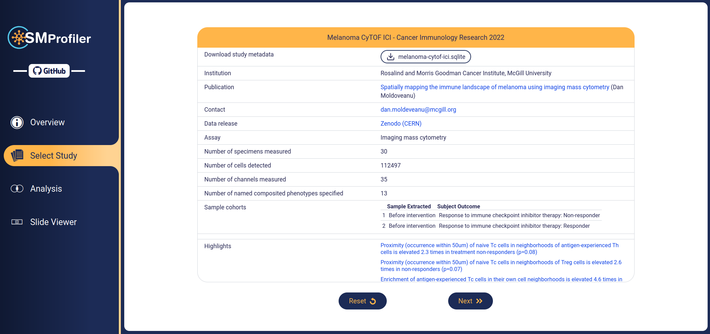

### <a id="choose-cell-phenotypes"></a> 2. Choose cell phenotypes
On the next page you can choose which cell phenotypes you want to focus on. Click one of the pre-defined phenotypes, or define a custom phenotype by indicating positive and negative markers from among the channels which were imaged.

We select five custom phenotypes. The first phenotype, for example, was defined by clicking the **+** beside **CD3+**, then clicking **Add to selection**. This generally indicates the T cells. The second phenotype is **CD3+ CD4+**, the markers of T helper cells. We also include: **CD3+ CD8A+**, **CD3+ CD4+ FOXP3+**, and **CD20+ CD3-**. We are ascertaining the rough profile of lymphocytes in the dataset.

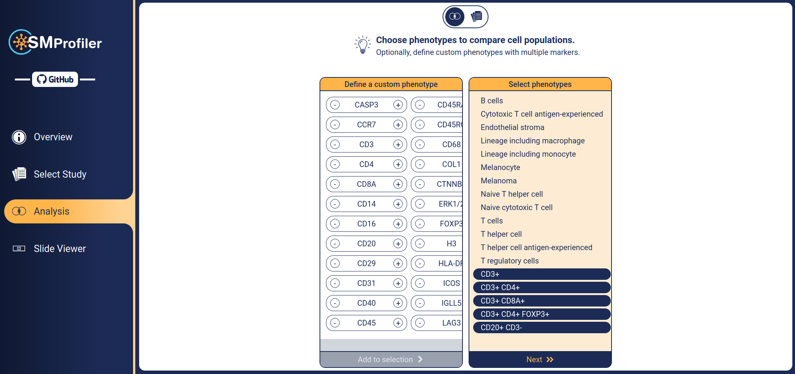

### <a id="aggregate-cell-population-fractions-and-overlaps"></a> 3. Aggregate cell population fractions and overlaps
The next page shows the cell population breakdown with respect to the phenotypes we've just selected. Each phenotype is shown with the fraction of cells expressing that phenotype across all samples, for example 54.02% are indicated as T cells.

In the grid, each *pair* of phenotypes is shown with the fraction of cells expressing *both* phenotypes. For example, the fraction of cells that are both **CD3+ CD4+ FOXP3+** and **CD3+** is 16.53%, the same as the fraction of cells that are **CD3+ CD4+ FOXP3+**, as expected since **CD3+** is part of the signature of this phenotype (the T regulatory cells).

> [!NOTE]
> :bar_chart: You could use this technique to make a standard heat map for assessment of clusters, by selecting all single-channel phenotypes. Since these metrics are computed live, depending on the size of the samples and the number of selected markers, this could take a few minutes.


### <a id="check-per-sample-values"></a> 4. Check per-sample values
To continue with a finer analysis, click one of the "tiles", either for one phenotype (the tiles on the left) or two phenotypes (the grid on the right).

We choose the tile at row **CD3+ CD4+ FOXP3+** (Treg) and column **CD3+ CD8A+** (Tc). The table below populates with the size of the population of cells expressing both signatures, broken down by sample. Note that in reality there are generally few cells expressing both of these two specific suites of markers, and the few cells occuring here are probably the result of an imperfect stain intensity dichotomization (thresholding, gating). So this tool can be used to do basic quality control in case some logical or illogical marker combinations are known in advance.

We also selected the single-phenotype tiles **CD3+ CD4+ FOXP3+** and **CD3+ CD8A**.

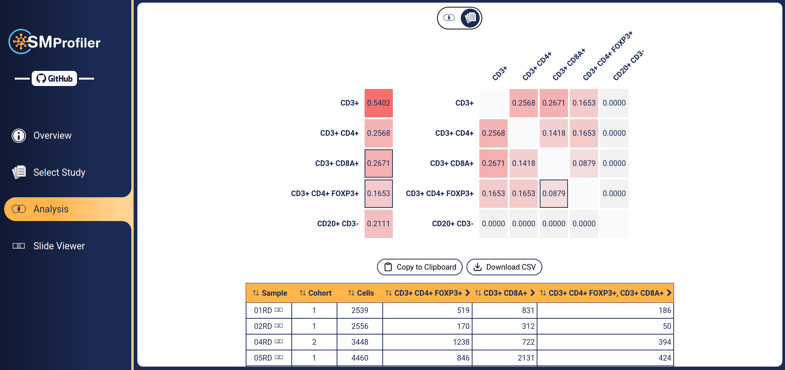

### <a id="assess-fractions"></a> 5. Assess phenotype fractions between cohorts
Click on the column header **CD3+ CD8A+** (it becomes underlined to indicate that it is selected). Then select the two cohorts by clicking one of the **1** values and one of the **2** values. A "verbalization" appears which states that the trend, according to a t-test, is that the fraction of Tc cells is increased about 1.5 times in the non-responder cohort compared to the responders, with statistical significance value p=0.1.

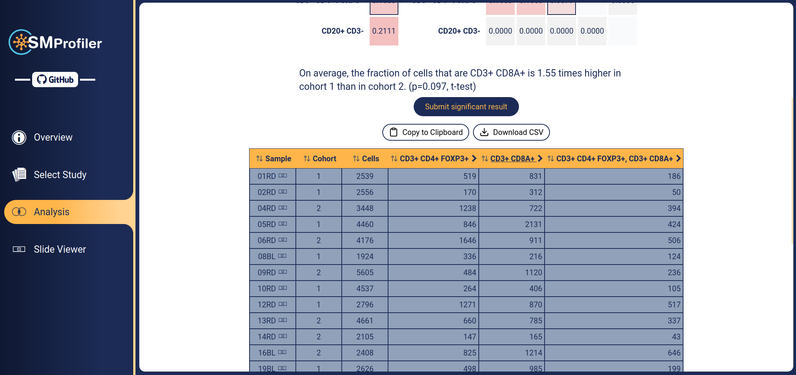

### <a id="assess-ratios"></a> 6. Assess ratios between cohorts
We click on column **CD3+ CD4+ FOXP3+**, in addition to the prior selection. A similar assessment appears, this time with respect to the ratio of the number of **CD3+ CD8A+** (the first selection) to **CD3+ CD4+ FOXP3+** (the second selection).


### <a id="open-slide-viewer"></a> 7. Open slide viewer
Let's focus our attention on one of the samples that exhibited a large fraction of Tc cells. Click **31RD**.

The "virtual slide viewer" opens. Choose a few phenotypes, and the corresponding cells will become highlighted. The fraction and count of the cells for each phenotype are shown.

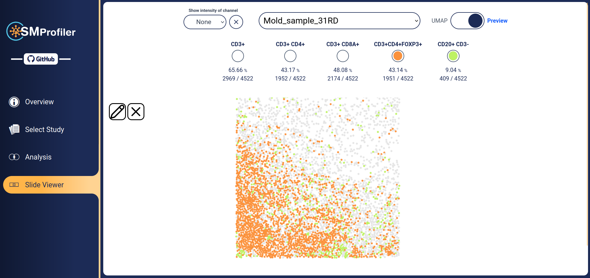

### <a id="umap-simple"></a> 8. Region selection and UMAP visualization
A UMAP dimensional reduction of the cell set across the whole data collection is available in this case. Click **UMAP**.

> [!NOTE]
> :mag: You can zoom and pan the view using scroll and click-and-drag.

We spot a region that looks "saturated" with Tc cells. Select it by clicking and dragging the mouse while holding either the **Ctrl** key or (on Mac) **CMD**.

The new cell count for each phenotype is now shown, together with the new percentage, relative to the selection. In this case the Tc fraction approximately doubled, to **5659** cells (shown in green). This increase is assessed using the Fisher test (the entire contingency table is also shown, for reference). The test verifies that the increase is highly statistically significant in this case, as expected.

> [!NOTE]
> By careful use of the selection tool, noting enrichments in each virtual region, you can account for most of the cell types present and hone the focus of study.

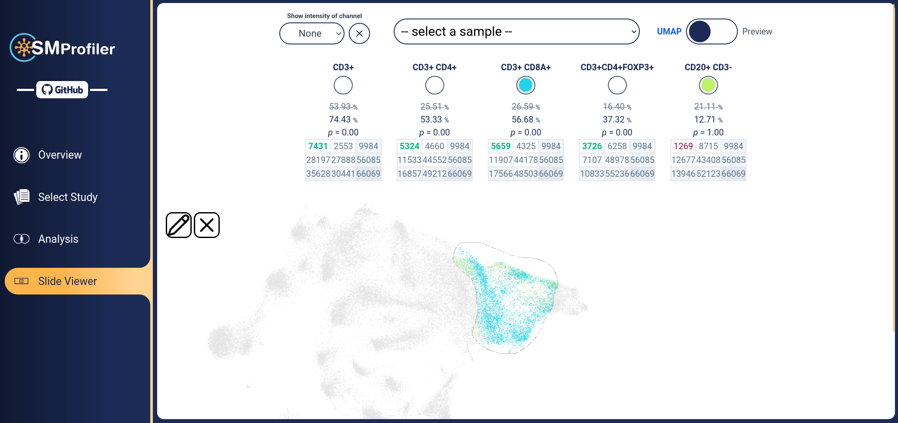

## <a id="spatially-informed-metrics"></a> Example: Spatially-informed metrics
1. [Compute a cell-set-to-cell-set proximity metric in realtime](#compute-proximity)
2. [Save and share results](#save-and-share)

### <a id="compute-proximity"></a> 1. Compute a cell-set-to-cell-set proximity metric in realtime
Let's see an example of quantification over samples that makes use of the spatial arrangement of cells.

Using the same dataset as the previous example, **Melanoma CyTOF ICI**, choose the phenotypes **Naive cytotoxic T cell** and **T helper cell antigen-experienced**. Select the tile with row **T helper cell antigen-experienced** and column **Naive cytotoxic T cell**, representing the pair of phenotypes.

In the column header that appears, click `>`. The **spatial metrics** dropdown appears. Click `v` to show the available metrics. Choose **cell-to-cell proximity**. After the metric is finished computing, click the column header **cell-to-cell proximity** and the two cohorts **1** and **2** to perform a univariate comparison.

This metric is the average number of **Naive cytotoxic T cells** appearing within a specified radius of given **T helper antigen-experienced** cells. It measures generally how common it is to find cells of one phenotype in close proximity to those of another phenotype. There are several other metrics available, of various degrees of statistical sophistication, many computed using the [Squidpy](https://squidpy.readthedocs.io/en/stable/) package. These are explained in more detail in the [API documentation](#api-reference).


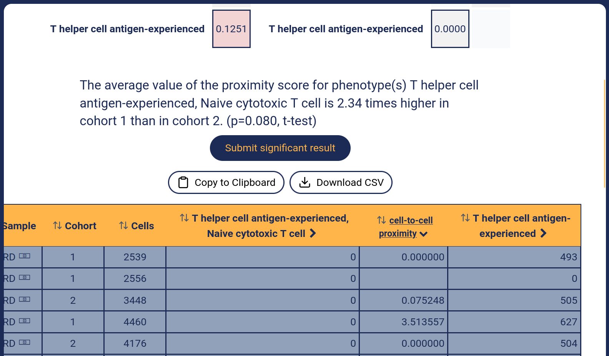

### <a id="save-and-share"></a> 2. Save and share results
:clipboard: You can **share or save results like this for later** by copying the URL in the address bar. In fact, this result is highlighted on the study summary page. Try reproducing it by following the first link as shown below.

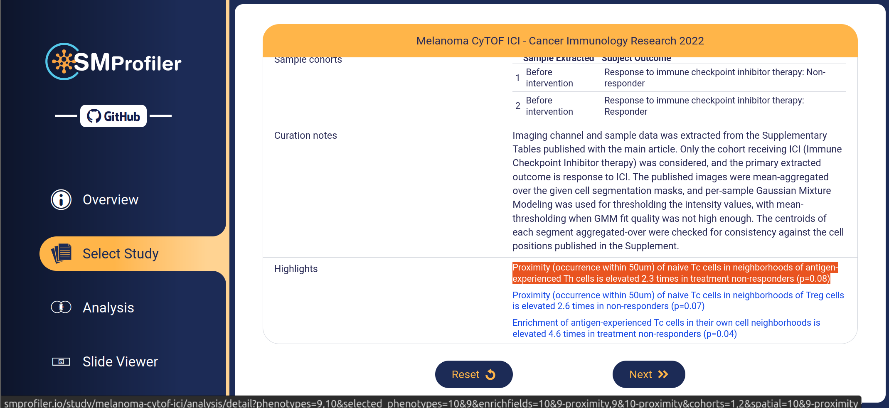

## <a id="orion-slide-viewer"></a> Example: B cell aggregation in colon cancer
1. [Observe tissue geometry patterning](#observe-tissue)
2. [Assess region enrichment with Fisher test](#fisher-test)

### <a id="choose-cell-phenotypes-orion"></a> Observe tissue geometry patterning
Select study **HTAN Orion CRC** and phenotypes:
- **T cytotoxic**
- **Epithelium**
- **B cell**

Review slide **C12** and observe the differing tissue localization.
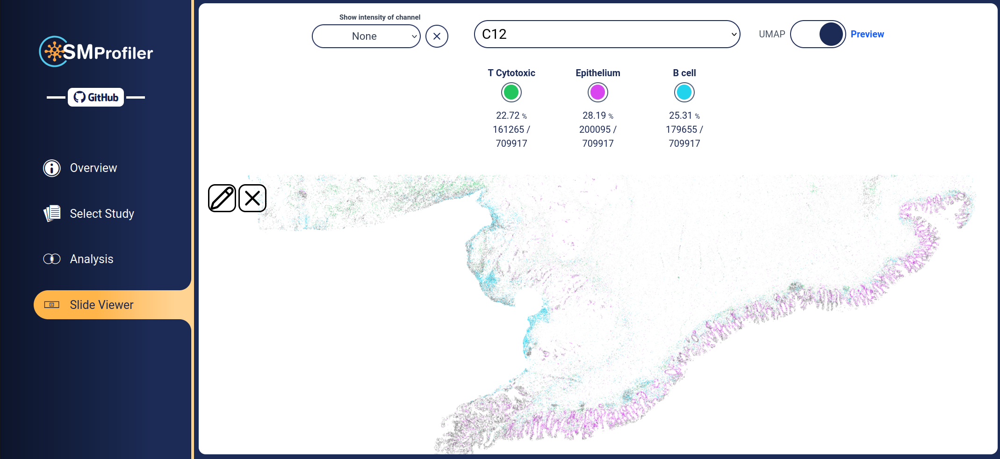

### <a id="fisher-test"></a> Assess region enrichment with Fisher test
A cluster of B cells is apparent, which we can assess by selecting this region with the drawing tool.

The assessment shows 25% baseline prevalence of B cells in this slide, elevated to 76% in the selected region. The Fisher test contingency table is shown.

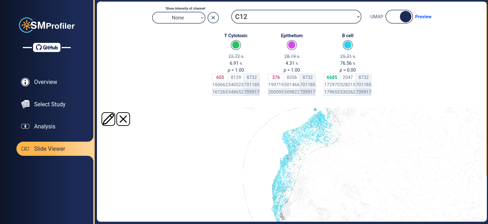

## <a id="channel-intensity"></a> Example: Channel intensity for phenotyping in bone marrow

Select the **Bone marrow aging** study, channel **CD61** with additional phenotype **Megakaryocyte**, and in the Slide Viewer select sample **WCM10**. In this study, a detailed model was trained to detect specific cell types from a number of imaging features. Megakaryocytes were associated with elevated CD61 levels, and in this example we can compare the **Megakaryocyte** assignments with the **CD61** expression levels by using the channel intensity threshold adjustment.


## <a id="whole-database-assessments"></a> Whole-database assessments for outcome associations
1. [Using all single marker cell phenotypes, frequency](#single-marker)
2. [Using all marker pairs, spatial proximity](#marker-pairs)

The datasets transformed and curated for the SMProfiler database are well-harmonized with each other, so that cross-cutting queries and whole-database surveys are readily performed.

### <a id="single-marker"></a> 1. Using all single marker cell phenotypes, frequency

In total around 50 markers were imaged across the 12 studies currently available. The all-markers overview assesses each marker for its utility in discriminating between key outcome cohorts within each given dataset, using the fractions of the cell set expressing the marker. The t-test provides a sense of the overall strength and statistical significance of any association found. In the plot (previewed below), the colors correspond to one sample cohort and relative size of a circle pair indicates the effective differential between the two cohorts using the given marker.

<p align="center">
<a href="https://smprofiler.io/channel-overview">

</a>
</p>

### <a id="marker-pairs"></a> 2. Using all marker pairs, spatial proximity

We can involve the spatial context in our whole-database assessment by computing the cell-set-to-cell-set proximity metric for each pair of markers. It is expected that the cohort discriminations provided by such marker pairs augments the results identified using dissociated cell sets defined by single markers (the fractions features), since these are based on an independent source of information.

<p align="center">
<a href="https://smprofiler.io/proximity-overview">

</a>
</p>

# Data management
To support this project's semantic integrity goals, we designed a general data model and ontology for cell-resolved measurement studies, using a schema-authoring system we call the Application Data Interface (ADI) framework.

The schema is called `scstudies` and it is documented in detail [here](https://adiframework.com/docs_site/scstudies_quick_reference.html#).

In our implementation, we sought to strike an effective balance between the completeness of annotation demanded by accurate record-keeping, on the one hand, and practicality and computational efficiency on the other. Much of the application is organized around a SQL database with a schema that conforms tightly to the formal `scstudies` data model, but we also make liberal use of derivative data artifacts to improve speed and performance. For example, a highly-compressed [binary format](docs/cells.md) is adopted for transmission of a given sample's cell-feature matrix.

Similarly, datasets that we have curated for uniform data import are stored in a simple tabular file format which does not generally support all the features of the `scstudies` model. This intermediary format is designed for ease of creation and it is not entirely formalized. For an example, see [data_curation/](data_curation/).

# CLI command reference
The Python package `smprofiler` is released on [PyPI](https://pypi.org/project/smprofiler/), so it can be installed with

```sh
python -m pip install smprofiler
```

Installation makes several commands available in the shell. List them with `smprofiler`:

```sh
$ smprofiler

smprofiler apiserver dump-schema

smprofiler graphs create-specimen-graphs
smprofiler graphs explore-classes
smprofiler graphs extract
smprofiler graphs finalize-graphs
smprofiler graphs generate-graphs
smprofiler graphs plot-importance-fractions
smprofiler graphs plot-interactives
smprofiler graphs prepare-graph-creation
smprofiler graphs upload-importances

smprofiler db cache-subsample
smprofiler db collection
smprofiler db count-cells
smprofiler db delete-feature
smprofiler db do-fractions-tests
smprofiler db drop
smprofiler db drop-ondemand-computations
smprofiler db guess-channels-from-object-files
smprofiler db interactive-uploader
smprofiler db list-studies
smprofiler db load-testing
smprofiler db retrieve-feature-matrices
smprofiler db review-submissions
smprofiler db status
smprofiler db sync-annotations
smprofiler db upload-sync-small

smprofiler ondemand assess-recreate-cache
smprofiler ondemand start

smprofiler workflow aggregate-core-results
smprofiler workflow configure
smprofiler workflow core-job
smprofiler workflow generate-run-information
smprofiler workflow initialize
smprofiler workflow merge-performance-reports
smprofiler workflow report-run-configuration
smprofiler workflow tail-logs
```

Each command will print documentation by providing the `--help` option.

Several commands are mainly for use internal to the application components.

Some others are TUIs (Terminal User Interfaces) meant to make common tasks, like uploading datasets or inspecting cache or metadata, more reliable.

## Dataset uploader
`smprofiler db interactive-uploader` is a TUI that automatically determines available data sources and targets after you have created or located source datasets (format: [data_curation/](data_curation/)). It looks for [database configuration files](smprofiler//workflow/assets/.smprofiler_db.config.template) named `~/.smprofiler_db.config.*`, checks the environment variable `SMPROFILER_S3_BUCKET`, and searches recursively for datasets in the current working directory named `generated_artifacts`. It presents available options and initiates the upload process.

Example usage is shown below.

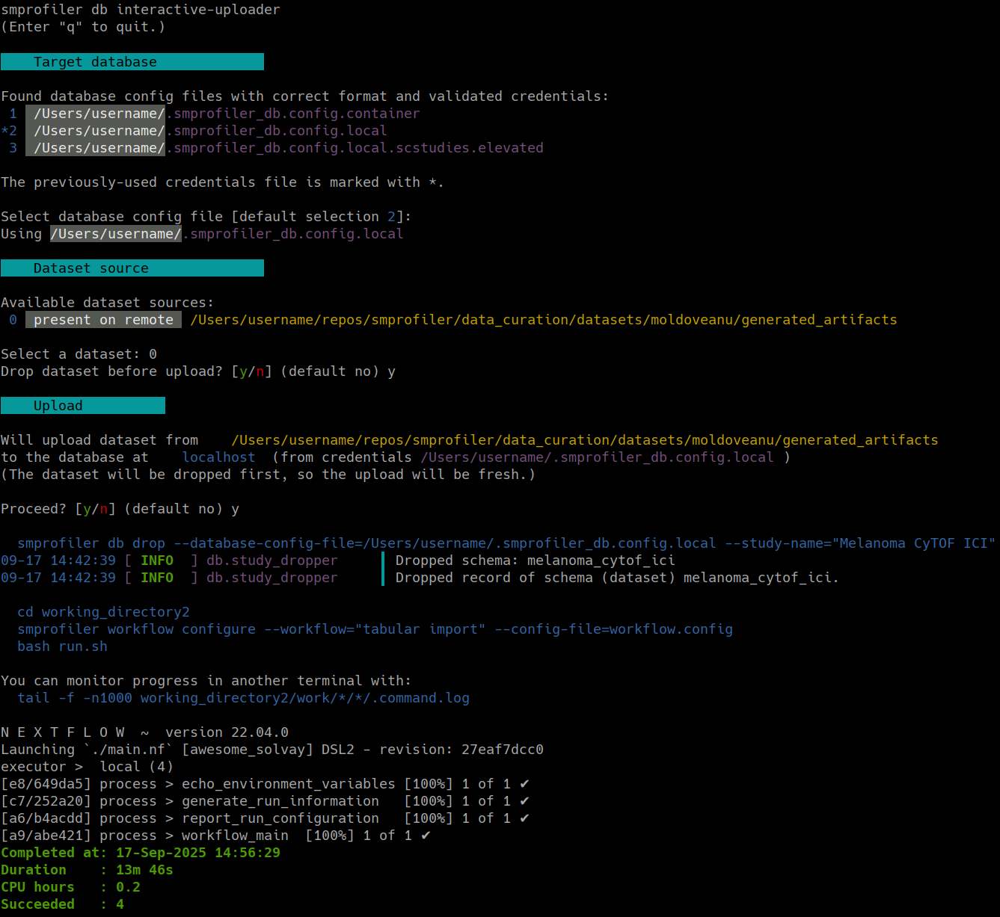

The ETL (Extract/Transform/Load) process includes a number of data integrity checks and the creation of several intermediate data artifacts.

# API reference
The SMProfiler application is supported by a web API, which provides fine-grained access to specific components of a given dataset. The API is documented [here](https://smprofiler.io/api/redoc).

# <a id="testing-development-maintenance"></a> Testing, development, and maintenance
See [docs/maintenance.md](docs/maintenance.md).

# Deployment options
For assistance setting up a deployment of the SMProfiler application for your institution or lab, send us an email at [nadeems@mskcc.org](nadeems@mskcc.org).

The application can be deployed in several ways:

- As manually-managed services on a single server
- Using Docker compose
- On a Kubernetes cluster using a cloud provider

[^1]: Moldoveanu et al. [*Spatially mapping the immune landscape of melanoma using imaging mass cytometry*](https://doi.org/10.1126/sciimmunol.abi5072)
[^2]: Sarachakov et al. [*Spatial mapping of human hematopoiesis at single-cell resolution reveals aging-associated topographic remodeling*](https://doi.org/10.1182/blood.2023021280)

## License
© [Nadeem Lab](https://nadeemlab.org/) - SMProfiler code is distributed under **Apache 2.0 with Commons Clause** license, and is available for non-commercial academic purposes.

## Funding
This work is funded by the 7-year NIH/NCI R37 MERIT Award ([R37CA295658](https://reporter.nih.gov/search/5dgSOlHosEKepkZEAS5_kQ/project-details/11018883#description)).


